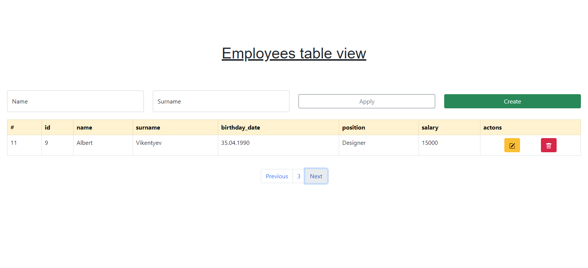

# crud-ui

## Simple ui for crud application, written with vanilla js

# Dependencies

Used libraries:
 - [JQuery](https://jquery.com/)
 - [Bootstrap](https://getbootstrap.com/)
 - [Lodash](https://lodash.com/)

All libraries included with CDN.

# Demo

You can check out live demo [here](https://crud.leins275.xyz)

# Develop

You can use simple http server to run this app locally, for example live server extension in vscode